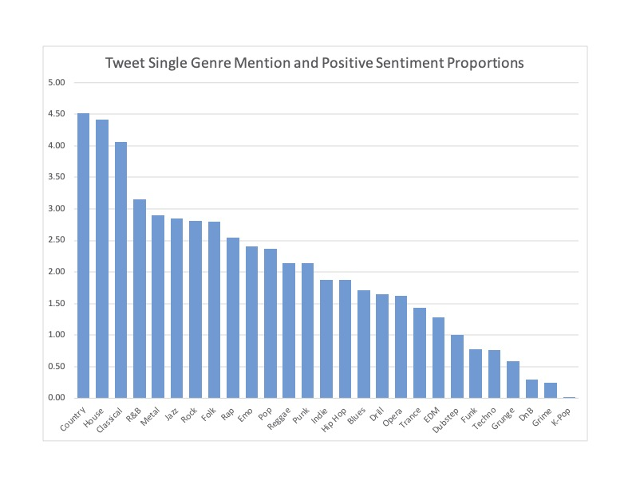

# Tweet Sentiment and Music Genere
An analysis of tweet sentiment related to music genre, and perhaps the first to detect the demise of K-Pop!

## The Original Study
Onbuy.com performed a [study](https://www.onbuy.com/gb/blog/language-study-reveals-the-happiest-music-fans~a421/) of the most popular subreddits for each of 27 genres of music to find the "happiest music fans". The company analyzed the genres with more than 20,000 members and performed [Positive Words Research](https://positivewordsresearch.com/top-positive-words-emotions-used-these-days-on-social-media/) for the 15 most commonly used positive words on Reddit. They then searched for the words in the subreddits over the last year of the study and summed the positive mentions per 100 comments. Using these frequencies, Onbuy.com compiled a list of the -so called- "happiest" genres. The top ten genres, according to the author's frequencies, in order, are as follows:

  1. Jazz
  1. Metal
  1. Opera
  1. Folk
  1. Indie
  1. Rock
  1. Trance
  1. Blues
  1. Grunge
  1. Classical
  - Etc.

The publication resulted in a flurry of other articles for famous genres each claiming bragging rights. For example, DJMag.com published a news article entitled "[Trance fans among the happiest music listeners, new study finds](https://djmag.com/news/trance-fans-amongst-happiest-music-listeners-new-study-finds)". Of course, that title is not "really" what the study found. Trance had the 7th highest frequency of the top 15 most used positive words on Reddit, for whatever reason... one of which may be because of opinion. The authors of the Onbuy study undoubtedly knew of the limitations of their interpretability, which is why they quietly clarified that happiest music fans meant "The music fans that used the most positive language online" according to their protocol (Paragraph 3).

## Limitations of Onbuy.com's study

Onbuy.com did not discuss the limitations of their study, though there is no indication their team was not aware of them.  

### Limitations related to Sentiment Analysis

The first major limitation is that happiness is an emotion, and sentiment does not *necessarily* relate to emotion. Instead, sentiment relates to opinions. I may have an opinion that popcorn is fantastic, write that on a message board or tweet, yet at the same time have an overall depressed affect, without any real dissonance to speak of. So to say that sentiment analysis, or even positive words research, reveals the "happiest music listeners" could be missleading. As stated earlier, Onbuy carefully crafted their message.

Even as a measure of opinions, there are problems related to humor, irony and subtleties in changing meanings related to emoticons and context that sentiment analysis is still likely to generate errors (Sidney, Loki, Nanjira, 2016, p. 3). If "holly crap!" is not explicitly listed in a dictionary-based sentiment analysis or supervised and unsupervised methods have not learned that particular word-combination case, the procedures are likely to get the sentiment of "crap," by itself, wrong, to use Sidney, Loki, and Nanjira's (2016, p. 3) example. In the one-word case, the sentiment is negative, however, in the multiple word case, the sentiment is positive!

### Limitations Related to Positive Words Research

Additionally, the authors used 15 of the most used positive words to establish their sentiment scores. This is akin to a dictionary-based method based on just 15 words, and not word combinations. The benefit of such a tactic is that a single sentence could carry more than one positive word, and this gives a way to quantify all of them at once. However, there may have been a database of over 2M Reddit comments, or 2M chances to miss represent the sentiment of the single word based on context, humor, irony and emoticon. Based on other words in the comments, an overall comment score using a full-blown sentiment analysis may be negative overall, even though the positive word was found.

### Limitations of Generalization

This author disagrees with Onbuy's generalization of data to the population of music listeners. Social scientists study the subtleties of populations. Reddit users may be fundamentally different from other social media platform users by important demographic factors, and therefore may not be generalized to the population. At best, a study of Reddit users tells us only of other Reddit users, on average.

# Literature Review

Looking at the distribution of the genre's for streamed music in 2020 in the US, we see that the genre in Onbuy's study that is associated with the highest frequency of the top 15 positive words on Reddit, Jazz, is actually only associated with a trace percentage of streaming music listeners in the US, at 0.7%, which wasn't even in the top 10 ([Statista.com](https://www.statista.com/statistics/475667/streamed-music-consumption-genre-usa/), 2020). In other words, Onbuy.com sampled from extremes in order to find effects from rare classes given major class imbalances. Sampling from extremes is a valid approach when major class imbalances exist, and tells us of differences between groups, however, can suffer from generalizability to other groups not in the study. 

Going back to the Statista.com results: Hip-Hop & R&B accounted for a third of streamed music, while Rock was half of that. 

  1. R&B/Hip-hop
  1. Rock
  1. Pop
  1. Country 
  1. Latin
  1. EDM
  1. Christian/gospel
  1. World
  1. Children
  1. Classical

Just to give an idea that the data were not cherry picked, another site lists *[music album consumption for 2020](https://playthetunes.com/music-genre-list/)* rather than streaming consumption, as perhaps Jazz listeners tend to purchase the albums? Not so. According to Buckley (Dec 9, 2020), Hip-Hop/Rap tops the charts at 12%, Techno is 2 at 10.4%, then R&B at 3 at 10.0%. See the top 10 breakdown below from the site: 

  1. Hip-Hop/Rap
  1. Trance
  1. R&B
  1. Punk
  1. Alternative Rock
  1. House
  1. Country
  1. Indie Rock
  1. EDM
  1. Latin

## Given the Limitations, What's the Business Question?

Given the limitations that only 15 words were used to established sentiment by the Onbuy team when entire vocabularies are available in, for example, the Vader library or a trained ensemble method, and given that Onbuy perhaps exceeded generalizability of their results to all music fans (at least as indicated by their title), it would be interesting to perform a similar kind of study on another social media platform. 

Do we reach similar conclusion to the Onbuy.com study using sentiment data for Tweets related to the same music genres for data collected from a two-week period from the Twitter API 2.0? Is Jazz held in higher regard, proportionally, compared to the other 26 genres in the study from Tweets in the United States on Twitter in the two weeks of data collection? 

This study is beneficial because it extends the results found by Onbuy.com to another form of Social Meida to a specific snapshot in time. 

# Methods v.1.0 -- Collected the last 2 weeks of August 2021.

Using Twitter API 2.0 with the ability to filter the recent tweets, search for tweets within the last 2 weeks with the keyword’s "music" and any of the genres from the Onbuy study, that's not a retweet, that does not contain a whole slew of phrases to filter out ads... 

``` python
rng = Generator(PCG64(seed=None))
g = np.array(['jazz','metal','opera','folk','indie','rock','trance','blues',
        'grunge', 'classical','funk','emo','reggae','country','k-pop','pop','techno',
        'edm','r&b','house','hip hop','hiphop','punk','dubstep','rap','drum and bass',        'grime','drill'])
genres = rng.choice(g, size=g.shape[0], replace=False)
```

## Lessons learned 

  - **Methods v.1.0** appended tweets to the datafile, which resulted in a data structure that I have yet to be able to open again once the data are written using the native JSON interface. Each set of writing has its own opening and closing curly braces, which does not follow the file structure expected by the pre-written load procedure. Given the time allotted, data went into the file, but never came out.

  - The ampersand symbol is handled as a special set of characters in the Twitter API v. 2.0. They are not quite escaped, but they are handled more like an emoji. Instead of the symbol "&", what is seen in the raw text is "&amp;". Thus, when searching for R&B, no records were found. 
  
  Also, alas, the list of genres is not all inclusive for the spelling variations. It appeared no records were found for R&B, which wouldn't make sense for a popular genre expected to be in the top 10. Below is an edited list that was used in Methods v.2.0, this time showing the whole loop. 

# Methods v.2.0

``` python
def main(df, df2):
    rng = Generator(PCG64(seed=None))
    g = np.array(['jazz','metal','opera','folk','indie','rock','trance','blues',
        'grunge', 'classical','funk','emo','reggae','country','k-pop','pop','techno','kpop',
        'edm','electronic','electronica','randb','rnb','r&amp;b','house','hip hop','hiphop',
        'hip-hop', 'punk','dubstep','rap','drum and bass', 'dnb','drumnbass','drum&amp;bass',
        'grime','drill'])
    genres = rng.choice(g, size=g.shape[0], replace=False)

    # Note: The query: had to be on one line with no new lines to prevent errors. New lines are
    # added here for ease of viewing. 
    for genre in genres:
            time.sleep(60*8) # Keep under API ask limits.
            query_params = {'query':f'-is:retweet music {genre} lang:en -RT -"RT" -politics -government -#tunein -live -@mixcloud -"now available" -Premiere -"Top 100" -radio -#NowPlaying -"now playing" -@YouTube -Favorited -@phoenix_rec -#Spotify -subscribe -"available now" -vote -"chance to win" -WIN',
                'tweet.fields': 'author_id,text,context_annotations', 
                'user.fields':'created_at,profile_image_url,username',
                'place.fields':'country',
                'max_results':'80'}
            print("Genre: ", genre)
            json_response = connect_to_endpoint(search_url, query_params)
            try:
                # Place tweets in a dataframe for later
                df = df.append(pd.json_normalize(json_response['data']))
                df2 = df2.append(pd.json_normalize(json_response['meta']))    
                print("New Data:")
                print(df.info())
                print(df2.info())
                print("\n\n\n")
            except:
                # For the case of no matching tweets -- "Electronica" and "R&B"
                print("\tError - Skipped")
                pass
            # return the dataframes
            return df, df2
```

## Data v2.0

Collected 60,400+ tweets over the 2 weeks using the API. Some ads and retweets still got through, which required cleaning. There were nearly 40,000 duplicates suggesting that I oversampled, despite the built-in time-delay. This suggests all of the tweets containing "music" and the name of the selected genres were collected for US tweets over the 2 weeks. Then @mentions, #hashtags were scrubbed. Emojis and emoticons were replaced with text-based equivalents. 

## Lesson's Learned -- EDA

In EDA, there were some more details realized...

  1. The genre list needed to be changed to a regular expression list for finding text inside the tweet text. For example, multiple spellings in data existed for k-pop, but that needed to be separate from the other genre "pop", using negation "[^k-]pop(\W|\s)". Using regular expressions: '[^k-]pop(\W|\s)'.
  1. Many of the tweets that mentioned one genre also mentioned another genre. While this brings up interesting questions about the properties of tweets that mention multiple genres, these tweets are not related to the question of interest and are therefore excluded.
  1. The exploratory code was revamped in order to identify counts of genres associated with each tweet. 
  1. Once I realized there were, in fact, tweets that mentioned only one genre, code was developed to isolate just those tweets. This results in a list of 14,579 unique and independent tweets.
  1. There was still only **two** 'r&amp;b|rnb|randb' records found for the remaining 14,579 tweets. Once the regular expression for R&B was expanded to the following, results made more sense for R&B: `'r amp b|r&amp;b|rnb|randb|r b(\W|\s)'`, as it was discovered in perusing the raw tweets that the "&" and ";" symbols were removed during cleaning. This was an unanticipated side effect of the cleaning routines that was easily accounted for. Once corrected, with a proper regex, counts were normal.

# Updated Business Question

Do we reach similar conclusion to the Onbuy.com study using sentiment data for Tweets related to the same music genres for data collected from a two-week period from the Twitter API 2.0, where the tweets of interest only mention one genre? Is Jazz held in higher regard, proportionally, compared to the other 26 genres in the study from Tweets in the United States on Twitter in the two weeks of data collection? 

Just by regression to the mean, I make the following, specific, predictions:

  - Jazz will not be regarded as highly as it was in the Onbuy study. Specifically, Jazz will not be found in the top 10, and will be replaced by R&B.
  - Trance will not be regarded as highly as it was in the Onbuy study. Specifically, Trance will not be found in the top 10 and will be replaced by Pop.
  - Opera will not be regarded as highly as it was in the Onbuy study. Specifically, Opera will not be found in the top 10 and will be replaced by EDM.

## Results

As stated earler, the proportions are to be calculated by n positive sentiment tweets per genere / total tweets and normalized to 100. (positive tweets in genre/total tweets) * 100. Since only the tweets that have one genre mention are used, the total for each genre sums to the total tweets used. 

## Table 1: 

<p align="center">
    
</p>

## Chart 1:

<p align="center">
    
</p>

Country tops this chart, followed by House and Classical. 

  - While Jazz is not apparent at the very top of the chart, it certainly is still in the top 10, landing at 6, and its first position was replaced by Country - breaking the second and third parts of the first prediction. 
  - Trance is not regarded as highly as it was in the Onbuy study. Trance is not in the top 10, but it was replaced by Rock, not Pop. 
  - Opera is not regarded as highly as it was in the Onbuy study. Opera is not in the top 10. Opera was replaced instead in this study by Classical, not the predicted EDM.
  
  Thus 5:4 is the prediction score, just better than half of the predictions were correct. The more general predictions based on regression to the mean were accurate, along with 2/3 of the "no longer in the top 10" predictions, however, the specific predictions were left wanting.

Last on the chart, and unanticipated, is the position of K-Pop. Does this result predict the demise of the K-Pop genre now that so few on Twitter are talking about K-Pop in tweets that just reference the genre in isolation of the other genres? Or is this finding an artifact of regular expressions used not picking up the difference between "k-pop" or "k pop" or "kpop" versus "pop" alone? I'll keep the possibility in the back of my mind for both outcomes, however, the k-pop finding was not an a-priori question so would need to be investigated separately.

# Discussion

There are four main reasons the Onbuy results did not coincide with the results here.

  1. Both studies are single sample studies with unknown variance. This one only has a span of 2 weeks, while the Onbuy study has a span of a year. We do not know how much the charts fluctuate from sample to sample.
  1. The studies were undertaken on different social media platforms, which limit their generalizability to results we could expect from people on other social media.
  1. The Onbuy results, and the results here, may be limited to a specific time-span. It may be that the number 15 so-called "happiest" rated K-Pop from the Onbuy study is now waning at this specific time-point due to factors such as popularity. The findings here are not a blow to Onbuy's methods for the next reason.
  1. We must keep in mind that the methods between this study and Onbuy's study are different.

One response to the disparity in study results is to write Onbuy and get their bag of words and analyze these data according to their methods to search for disparities based on methods.